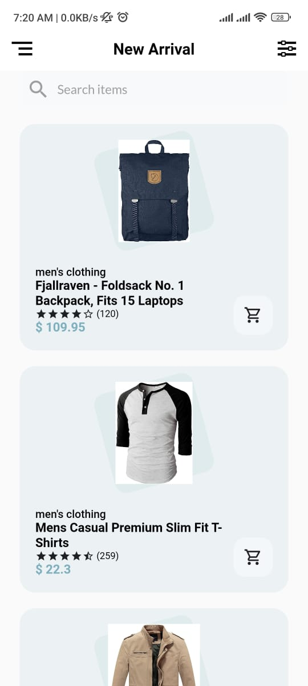
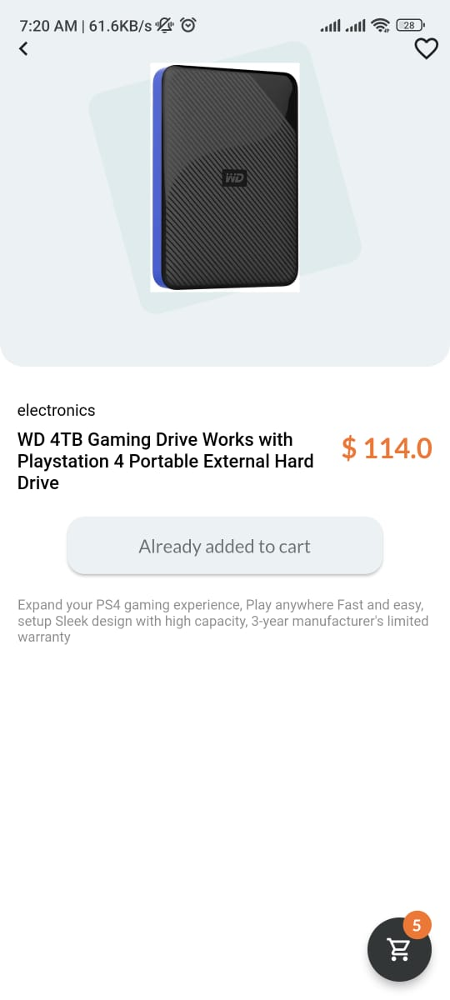
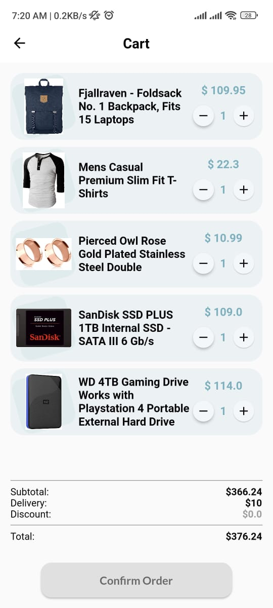

# Ecommarce App
This app has been created using Flutter

# Contents
* Product sync
* Add to cart option
* Product Details view
* Drawer
* Responsive UI
* GetX state management

# Dependencies
* cupertino_icons: ^1.0.5
* get: 4.6.5
* google_fonts: ^4.0.1
* dio: ^4.0.6
* flutter_svg: ^1.1.6
* cached_network_image: ^3.2.3
* flutter_rating_bar: ^4.0.1

# APK
* [Download](https://drive.google.com/file/d/1yzR4Sf9MqncogsLPraSkiK-UAecNZMTh/view?usp=sharing)

# Screenshots
  

